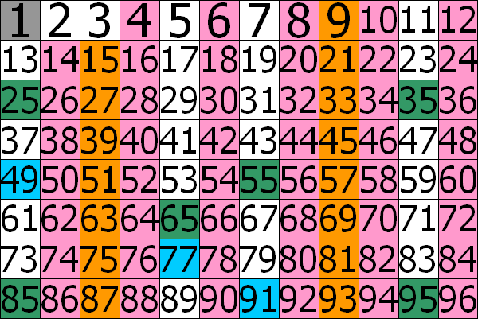

# Números primos

## Motivação

Os números primos são números que possuem apenas dois divisores: $1$ e ele mesmo. Apesar da definição simples, muitos mistérios rondam estes números: qual a distribuição deles, dado um determinado número, é primo ou não é; quantos primos existem de um intervalo a outro, etc. Até hoje, não existe um método rápido para determinar se um número qualquer é primo ou não e isso é incrivelmente importante para a criptografia atual, que é baseada em números gigantescos que são fatorados em números primos igualmente enormes.

Os algoritmos que veremos aqui funcionam até um determinado limite que é o suficiente para resolvermos os problemas da plataforma. Veremos um algoritmo linear, uma versão mais otimizada e, por fim, um método simples, mas mais eficaz de encontrar primos pequenos de maneira rápida e fácil, além de um truque de como usar este método para encontrar primos maiores do que o limite do método.

## Algoritmos

### Algoritmo trivial - Complexidade $O(n)$ para cada número n testado

Se um número primo é um número que só tem apenas dois divisores: $1$ e ele mesmo, se quisermos conferir se n é um número primo, basta conferir se algum número entre $2$ e $n - 1$ é um divisor. Caso seja, o número não é primo e caso contrário, o número é primo.

Uma ideia de melhorar esta verificação, que é muito lenta para números razoavelmente grandes, é verificar apenas os valores menores que $\sqrt{n}$, já que a partir deste valor, todas as verificações são espelhadas.

### Crivo de Eratóstenes - Complexidade $O(m log log m)$ para todos os números entre $1$ e $m$, com $m$ até $10^{7}$

Para calcular primos até $10^{7}$ de forma mais rápida e eficiente, podemos usar um método simples chamado crivo de Eratóstenes. Ao final do crivo teremos em um vetor de tamanho $m$, onde $m$ é o maior número permitido para as consultas, onde pode-se acessar um _booleano_ indicando se o número representado pelo índice é ou não primo.

Para preenchermos corretamente este vetor, começamos com todos os valores verdadeiros e prosseguimos com três instruções:

* Marcar o índice $1$ como falso ($1$ não é um número primo).
* Marcar todos os índices pares maiores que $2$ como falsos (nenhum número par maior que $2$ é primo).
* Verificar o valor de cada elemento de índice ímpar de $3$ até $m$:
  * Se o elemento está marcado como verdadeiro, marcar como falso todos os seus múltiplos (que são comprovadamente não primos, pois são múltiplos deste número).

O processo do algoritmo é representado visualmente pela figura abaixo:



Pelo figura, podemos ver que o número cinza foi marcado pela primeira instrução e os números rosa foram marcados pela segunda instrução. Enquanto isso, os números tanto em laranja quanto em verde e quanto em azul foram marcados pela terceira instrução, sendo os laranjas ao verificar que o número $3$ está com valor verdadeiro, os verdes pelo número $5$ e os azuis pelo número $7$. Ao final, todos os números brancos representam todos os números primos menores que $96$.

Agora, uma dúvida que pode restar é saber como ter certeza que os números que não foram marcados como falso são comprovadamente verdadeiros. Vamos supor que um número não-primo $q$ não tivesse sido marcado com um valor falso, ou seja, de que algum jeito, este número conseguiu passar no crivo sem ser provado falso. Se $q$ não é primo, então temos um fator primo que divide $q$. Com isso, não é possível que $q$ não seja marcado como falso, já que o crivo passaria por tal fator primo e marcaria como falso todos os múltiplos deste fator, incluindo $q$. Logo, por contradição, não é possível que um número não-primo continue verdadeiro ao final do crivo.

Com este método, podemos calcular muito mais rápido a primalidade de qualquer número até $10^{7}$ com uma única operação com passos fixos e um acesso direto.

#### C99
```c
void Crivo(int *C, int n)
{
    for (int i = 0; i < n; ++i)
    {
        C[i] = 1;
    }
    C[1] = 0;

    for (int i = 4; i < n; i += 2)
    {
        C[i] = 0;
    }

    for (int i = 3; i < n; i += 2)
    {
        if (C[i] == 1)
        {
            for (int j = i * 3; j < n; j += 2 * i)
            {
                C[j] = 0;
            }
        }
    }
}
```

#### C++17
```cpp
void Crivo(vector<bool> &C, int n)
{
    C.assign(n, true);

    C[1] = false;

    for (int i = 4; i < n; i += 2)
    {
        C[i] = false;
    }

    for (int i = 3; i < n; i += 2)
    {
        if (C[i])
        {
            for (int j = i * 3; j < n; j += 2 * i)
            {
                C[j] = false;
            }
        }
    }
}
```

#### C#
```cs
static void Crivo(bool[] C) {
    int n = C.Length;
    for(int i = 0; i < n; ++i){
        C[i] = true;
    }
    
    C[1] = false;
    
    for(int i = 4; i < n; i += 2){
        C[i] = false;
    }
    
    for(int i = 3; i < n; i += 2){
        if(C[i]){
            for(int j = i * 3; j < n; j += 2 * i){
                C[j] = false;
            }
        }
    }
}
```

#### Java 19
```java
public static void Crivo(boolean[] C){
    int n = C.length;
    for(int i = 0; i < n; ++i){
        C[i] = true;
    }
    
    C[1] = false;
    
    for(int i = 4; i < n; i += 2){
        C[i] = false;
    }
    
    for(int i = 3; i < n; i += 2){
        if(C[i]){
            for(int j = i * 3; j < n; j += 2 * i){
                C[j] = false;
            }
        }
    }
}
```

#### JavaScript 12.18
```js
const Crivo = (n) => {
    let C = Array(n);
    C.fill(true);

    C[1] = false;

    for (let i = 4; i < n; i += 2) {
        C[i] = false;
    }

    for (let i = 3; i < n; i += 2) {
        if (C[i]) {
            for (let j = i * 3; j < n; j += 2 * i) {
                C[j] = false;
            }
        }
    }
    
    return C;
};
```

#### Python 3.9
```py
def Crivo(n):
    C = [True for _ in range(n)]

    C[1] = False

    for i in range(4, n, 2):
        C[i] = False

    for i in range(3, n, 2):
        if(C[i]):
            for j in range(i * 3, n, 2 * i):
                C[j] = False

    return C
```

### Crivo de Eratóstenes para números até $10^{14}$ - Complexidade $O(k)$, onde k é o número de primos menores que $\sqrt{n}$

Mesmo que o método seja limitado pelo tamanho do vetor, ainda sim podemos fazer um truque para podermos calcular de forma mais rápida a primalidade de números maiores que $10^{7}$. Para isso, basta combinarmos as duas técnicas que vimos: usamos o crivo de Eratóstenes para conseguir todos os números primos até $\sqrt{m}$ e, com isso, usamos o algoritmo trivial para testar cada um destes primos para ver se o número requisitado é divisível por um testes números ou não.

É uma forma bem criativa e eficiente de se pensar na solução que vai além dos limites estabelecidos pelo método.

#### C99
```c
int Crivo(int *C, int *primos, int n)
{
    int p = 0;

    for (int i = 0; i < n; ++i)
    {
        C[i] = 1;
    }
    C[1] = 0;
    primos[p++] = 2;

    for (int i = 4; i < n; i += 2)
    {
        C[i] = 0;
    }

    for (int i = 3; i < n; i += 2)
    {
        if (C[i] == 1)
        {
            primos[p++] = i;

            for (int j = i * 3; j < n; j += 2 * i)
            {
                C[j] = 0;
            }
        }
    }

    return p;
}

int ehPrimo(int *primos, int p, int n)
{
    int limite = sqrt(n) + 1;

    for (int i = 0; i < p && primos[i] < limite; ++i)
    {
        if (n % primos[i] == 0)
        {
            if (n == primos[i])
                return 1;
            return 0;
        }
    }

    return 1;
}
```

#### C++17
```cpp
void Crivo(vector<bool> &C, vector<int> &primos, int n)
{
    C.assign(n, true);

    C[1] = false;
    primos.push_back(2);

    for (int i = 4; i < n; i += 2)
    {
        C[i] = false;
    }

    for (int i = 3; i < n; i += 2)
    {
        if (C[i])
        {
            primos.push_back(i);

            for (int j = i * 3; j < n; j += 2 * i)
            {
                C[j] = false;
            }
        }
    }
}

bool ehPrimo(vector<int> &primos, int n)
{
    int p = primos.size();
    int limite = sqrt(n) + 1;

    for (int i = 0; i < p && primos[i] < limite; ++i)
    {
        if (n % primos[i] == 0)
        {
            return (n == primos[i]);
        }
    }

    return true;
}
```

#### C#
```cs
static void Crivo(ref List<bool> C, ref List<int> primos, int n){
    for(int i = 0; i < n; ++i){
        C.Add(true);
    }
    
    C[1] = false;
    primos.Add(2);
    
    for(int i = 4; i < n; i += 2){
        C[i] = false;
    }
    
    for(int i = 3; i < n; i += 2){
        if(C[i]){
            primos.Add(i);
            
            for(int j = i * 3; j < n; j += 2 * i){
                C[j] = false;
            }
        }
    }
}

static bool ehPrimo(ref List<int> primos, int n){
    int p = primos.Count;
    int limite = (int)Math.Sqrt(n) + 1;
    
    for(int i = 0; i < p && primos[i] < limite; ++i){
        if(n % primos[i] == 0){
            return (n == primos[i]);
        }
    }
    
    return true;
}
```

#### Java 19
```java
public static void Crivo(ArrayList<Boolean>C, ArrayList<Integer> primos, int n){
    for(int i = 0; i < n; ++i){
        C.add(true);
    }
    
    C.set(1, false);
    primos.add(2);
    
    for(int i = 4; i < n; i += 2){
        C.set(i, false);
    }
    
    for(int i = 3; i < n; i += 2){
        if(C.get(i)){
            primos.add(i);
            
            for(int j = i * 3; j < n; j += 2 * i){
                C.set(j, false);
            }
        }
    }
}

public static boolean ehPrimo(ArrayList<Integer> primos, int n){
    int p = primos.size();
    int limite = (int)Math.sqrt(n) + 1;
    
    for(int i = 0; i < p && primos.get(i) < limite; ++i){
        if(n % primos.get(i) == 0){
            return (n == primos.get(i));
        }
    }
    
    return true;
}
```

#### JavaScript 12.18
```js
const Crivo = (n) => {
    let C = Array(n);
    C.fill(true);

    let primos = [];

    C[1] = false;
    primos.push(2);

    for (let i = 4; i < n; i += 2) {
        C[i] = false;
    }

    for (let i = 3; i < n; i += 2) {
        if (C[i]) {
            primos.push(i);

            for (let j = i * 3; j < n; j += 2 * i) {
                C[j] = false;
            }
        }
    }

    return primos;
};

const ehPrimo = (primos, n) => {
    let limite = Math.ceil(Math.sqrt(n));

    for (let i = 0; i < primos.length && primos[i] < limite; ++i) {
        if (n % primos[i] === 0) {
            return (n === primos[i]);
        }
    }

    return true;
};
```

#### Python 3.9
```py
def Crivo(n):
    C = [True for _ in range(n)]
    primos = []

    C[1] = False
    primos.append(2)

    for i in range(4, n, 2):
        C[i] = False

    for i in range(3, n, 2):
        if(C[i]):
            primos.append(i)

            for j in range(i * 3, n, 2 * i):
                C[j] = False

    return primos


def ehPrimo(primos, n):
    limite = math.ceil(math.sqrt(n))

    for primo in primos:
        if(primo > limite):
            return True
        elif(n % primo == 0):
            return (n == primo)

    return True
```

## Problemas

* [1032 - O Primo de Josephus](../../../problemas/ad-hoc/1032/README.md)
* [1165 - Número Primo](../../../problemas/iniciante/1165/README.md)
* [1221 - Primo rápido](../../../problemas/matematica/1221/README.md)