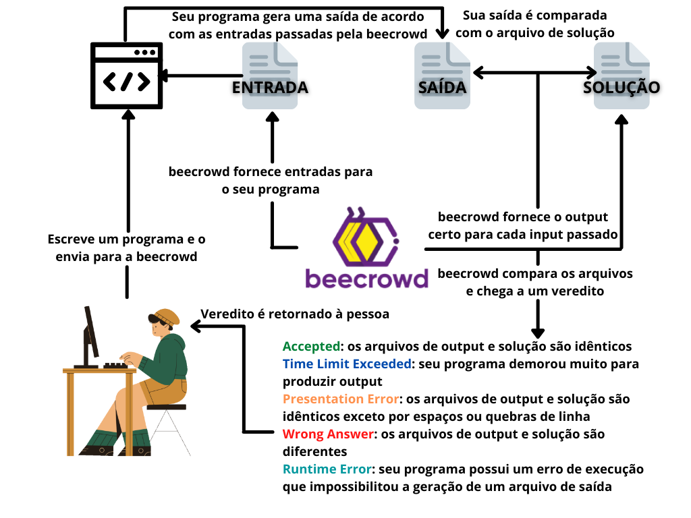

# beecrowd

## Como funciona a beecrowd?

A beecrowd funciona através de um juiz automático que executa o código que você envia, insere entradas pela entrada padrão e salva cada saída produzida pelo seu código em um arquivo. Dessa maneira, lá nos servidores da beecrowd, eles têm acesso a um arquivo que seria a solução esperada do problema para cada input passado e tudo que é feito é fazer um comando para verificar a diferença entre o arquivo de solução que eles têm presente lá com o arquivo de saída produzido pelo seu programa. De acordo com o resultado da comparação, vereditos diferentes são dados. Você pode descobrir o que cada resposta significa no [FAQ de respostas da beecrowd](https://www.beecrowd.com.br/judge/pt/answers).

Lembrando que **não** é necessário lidar com arquivos explicitamente no seu código, ou seja, você não precisa lidar com comandos para abrir e fechar arquivos para a entrada e saída do seu programa, com exceções apenas em algumas linguagens específicas. Na página [Preparando o ambiente](../preparando-o-ambiente/README.md), eu procuro explicar melhor como arrumar um ambiente para treinar programação na beecrowd na sua máquina ou em um compilador online.

Para mais dúvidas, acesse o [FAQ da própria beecrowd](https://www.beecrowd.com.br/judge/pt/faqs/about).