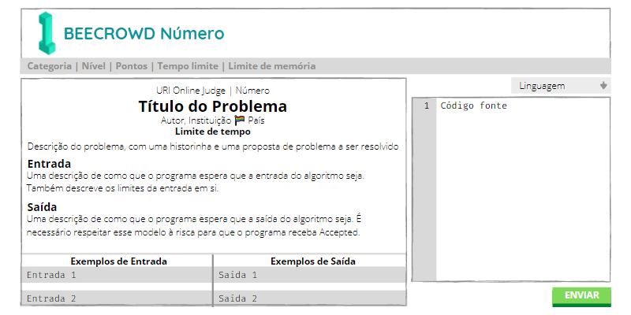

# Estrutura de um problema

Todo problema da beecrowd é estruturado da seguinte forma, salvo raríssimas exceções:

* Título com o número do problema;
* Uma linha com a categoria, nível, pontos, tempo limite e limite de memória do problema:
  * **Categoria:** a beecrowd possui diversas categorias de problema e tal categoria é exposta tanto neste menu compreensivo quanto pelo número e esquema de cores do problema;
  * **Nível:** o quão difícil é o problema em uma escala de 1 a 10, decidido pelos feedbacks dos usuários que já resolveram o problema antes;
  * **Pontos:** quantos pontos você vai ganhar se resolver o problema, onde quanto mais pontos, mais você sobe no ranking da beecrowd;
  * **Tempo limite:** quanto tempo seu programa tem para executar cada uma das entradas;
  * **Limite de memória:** quanto de memória seu programa pode usar para processar as entradas;
* À esquerda:
  * **Título:** número do problema, seu respectivo nome (título), autor, instituição do autor, país do autor (ou da instituição) e tempo limite para resolução do problema, equivalente ao tempo limite da linha acima;
  * **Descrição do problema:** que pode contar uma historinha curta e que apresenta o problema a ser resolvido. Boa interpretação do enunciado também faz parte do desafio, mas até hoje eu não encontrei um problema que propositalmente escondia informação da pessoa, normalmente as descrições são bem esclarecedoras, salvo algumas exceções.
  * **Descrição da entrada:** descreve de que maneira você pode esperar que venham as entradas, não sendo necessário fazer nenhuma validação além do que está escrito ali. Por exemplo, se na entrada está escrito que virão dois números inteiros, você não precisa verificar se o que está vindo na entrada é de fato um inteiro. Também fala sobre os limites das entradas, qual o tamanho máximo dos números e strings envolvidas, o que é extremamente útil. A seção [Resolvendo problemas](../resolvendo-problemas/README.md) apresenta mais sobre essa ideia e é onde eu explico porque a descrição da entrada é tão importante.
  * **Descrição da saída:** descreve de que maneira o seu programa deve produzir a saída, esquematizando como que a resposta deve ser apresentada. Essas instruções devem ser seguidas à risca, caso contrário, você receberá _Presentation Error_, que é quando seu programa produz a resposta correta, mas no formato errado.
  * **Tabela com exemplos de entrada e saída:** para cada entrada, naquele formato apresentado, qual seria a saída apropriada, também no modelo certinho descrito acima.
* À direita:
  * **Linguagem:** um menu para você escolher com qual linguagem você vai trabalhar, com qual versão. Aqui também aparece o compilador que a beecrowd vai usar para julgar seu programa, para que você possa instalar a mesma versão. Na minha experiência, a única linguagem onde isso faz alguma diferença é Pascal.
  * **Código fonte:** o campo de texto onde você vai colar seu código para julgamento pela beecrowd. É mais fácil falar do que fazer, mas procure só enviar seu código se você acredita que tem chances que seu código receba _Accepted_, a fim de evitar sobrecarregar os servidores da beecrowd e também seu coração.
  * **Botão Enviar:** o botão que você aperta para enviar seu código, basicamente isso.