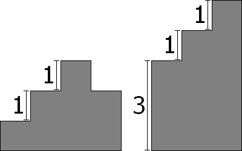

# 1107 - Escultura à Laser

## [Descrição](https://www.beecrowd.com.br/judge/pt/problems/view/1107)

## Solução

Para sabermos quantas vezes precisamos ligar o laser, basta comparar as alturas de cada bloco com a altura do bloco anterior, agregando ao número de vezes que vai ligar o laser todas as vezes que tal diferença for maior que zero.



Lembrando que ainda é necessário fazer a diferença entre a altura do bloco total e o último bloco, para o caso em que o último bloco é menor que a altura total do bloco.

### C99
```c
#include <stdio.h>

int main()
{
    int A, C, anterior, atual, resposta;

    while (scanf("%d %d", &A, &C))
    {
        if (!A && !C)
            break;

        resposta = 0;
        scanf("%d", &anterior);
        for (int i = 1; i < C; ++i)
        {
            scanf("%d", &atual);

            if (atual > anterior)
            {
                resposta += atual - anterior;
            }
            anterior = atual;
        }
        resposta += A - anterior;

        printf("%d\n", resposta);
    }

    return 0;
}
```

### C++17
```cpp
#include <iostream>

using namespace std;

int main()
{
    int A, C, anterior, atual, resposta;

    while (cin >> A >> C)
    {
        if (!A && !C)
            break;

        resposta = 0;
        cin >> anterior;
        for (int i = 1; i < C; ++i)
        {
            cin >> atual;

            if (atual > anterior)
            {
                resposta += atual - anterior;
            }
            anterior = atual;
        }
        resposta += A - anterior;

        cout << resposta << endl;
    }

    return 0;
}
```

### JavaScript 12.18
```javascript
var input = require('fs').readFileSync('/dev/stdin', 'utf8');
var lines = input.trim().split('\n');

lines.pop();

while(lines.length){
    let [A, C] = lines.shift().trim().split(' ').map((x) => parseInt(x));
    let blocos = lines.shift().trim().split(' ').map((x) => parseInt(x));

    let resposta = 0;
    for(let i = 1; i < C; ++i){
        if(blocos[i] > blocos[i - 1]){
            resposta += blocos[i] - blocos[i - 1];
        }
    }
    resposta += A - blocos[C - 1];

    console.log(resposta);
}
```

### Python 3.9
```python
while True:
    try:
        A, C = [int(x) for x in input().strip().split(' ')]
        blocos = [int(x) for x in input().strip().split(' ')]

        resposta = 0
        for i in range(1, C):
            if(blocos[i] > blocos[i - 1]):
                resposta += blocos[i] - blocos[i - 1]
        resposta += A - blocos[C - 1]

        print(resposta)
    except EOFError:
        break
```