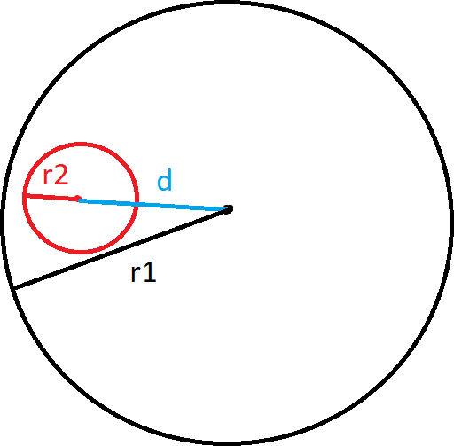

# 1039 - Flores de Fogo

## [Descrição](https://www.beecrowd.com.br/judge/pt/problems/view/1039)

## Solução

O círculo da flor deve estar todo dentro do círculo do caçador. Para isso acontecer, é necessário que a soma da distância entre os dois centros com o raio da flor seja menor que o raio do caçador. A imagem abaixo esquematiza porque esse é o caso:



Logo, temos que para que o círculo da flor esteja dentro do círculo do caçador (que na fórmula botamos homem porque não dá pra escrever cedilha), $dist(C_{flor}, C_{homem}) + R_{flor} \leq R_{homem} \Rightarrow dist(C_{flor}, C_{homem}) \leq R_{homem} - R_{flor}$ precisa ser verdade.

### C99

```c
#include <stdio.h>
#include <math.h>

double dist(int x1, int y1, int x2, int y2)
{
    return sqrt((x1 - x2) * (x1 - x2) + (y1 - y2) * (y1 - y2));
}

int main()
{
    int r1, x1, y1, r2, x2, y2;

    while (scanf("%d %d %d %d %d %d", &r1, &x1, &y1, &r2, &x2, &y2) != EOF)
    {
        if (dist(x1, y1, x2, y2) <= (r1 - r2))
        {
            printf("RICO\n");
        }
        else
        {
            printf("MORTO\n");
        }
    }

    return 0;
}
```

### C++17

```cpp
#include <iostream>
#include <cmath>

using namespace std;

double dist(int x1, int y1, int x2, int y2)
{
    return sqrt((x1 - x2) * (x1 - x2) + (y1 - y2) * (y1 - y2));
}

int main()
{
    int r1, x1, y1, r2, x2, y2;

    while (cin >> r1 >> x1 >> y1 >> r2 >> x2 >> y2)
    {
        if (dist(x1, y1, x2, y2) <= (r1 - r2))
        {
            cout << "RICO" << endl;
        }
        else
        {
            cout << "MORTO" << endl;
        }
    }

    return 0;
}
```

### C#

```cs
using System;
using System.Runtime;
using System.Linq;

class URI {
    static double dist(int x1, int y1, int x2, int y2){
        return Math.Sqrt((x1 - x2) * (x1 - x2) + (y1 - y2) * (y1 - y2));
    }

    static void Main(string[] args) {
        string entrada;

        while((entrada = Console.ReadLine()) != null){
            int[] numeros = entrada.Trim().Split(' ').Select(x => int.Parse(x)).ToArray();

            if(dist(numeros[1], numeros[2], numeros[4], numeros[5]) <= numeros[0] - numeros[3]){
                Console.WriteLine("RICO");
            }else{
                Console.WriteLine("MORTO");
            }
        }
    }
}
```

### Java 14

```java
import java.io.BufferedReader;
import java.io.IOException;
import java.io.InputStreamReader;
import java.lang.Math;

public class Main {
    public static double dist(int x1, int y1, int x2, int y2) {
        return Math.sqrt((x1 - x2) * (x1 - x2) + (y1 - y2) * (y1 - y2));
    }

    public static void main(String[] args) throws IOException {
        InputStreamReader ir = new InputStreamReader(System.in);
        BufferedReader in = new BufferedReader(ir);

        while (in.ready()) {
            String[] entrada = in.readLine().trim().split(" ");
            int[] numeros = new int[entrada.length];
            for (int i = 0; i < 6; ++i) {
                numeros[i] = Integer.parseInt(entrada[i]);
            }

            if (dist(numeros[1], numeros[2], numeros[4], numeros[5]) <= numeros[0] - numeros[3]) {
                System.out.println("RICO");
            } else {
                System.out.println("MORTO");
            }
        }
    }
}
```

### Javascript 12.18

```js
var input = require('fs').readFileSync('/dev/stdin', 'utf8');
var lines = input.trim().split('\n');

let dist = (x1, y1, x2, y2) => Math.sqrt((x1 - x2) * (x1 - x2) + (y1 - y2) * (y1 - y2));

while (lines.length) {
    let [r1, x1, y1, r2, x2, y2] = lines.shift().trim().split(' ').map(x => parseInt(x));

    if (dist(x1, y1, x2, y2) <= r1 - r2) {
        console.log("RICO");
    } else {
        console.log("MORTO");
    }
}
```

### Python 3.9

```py
import math


def dist(x1, y1, x2, y2):
    return math.sqrt((x1 - x2) * (x1 - x2) + (y1 - y2) * (y1 - y2))


while True:
    try:
        r1, x1, y1, r2, x2, y2 = [int(x) for x in input().strip().split(' ')]

        if(dist(x1, y1, x2, y2) <= r1 - r2):
            print("RICO")
        else:
            print("MORTO")
    except EOFError:
        break
```