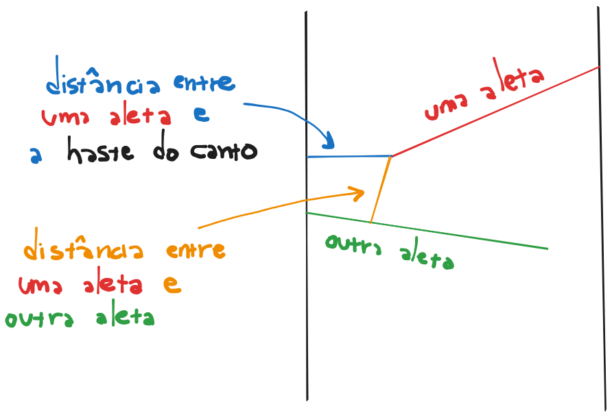

# 1223 - Tobogan de Bolinhas

## [Descrição](https://www.beecrowd.com.br/judge/pt/problems/view/1223)

## Solução

Para cada aleta temos que medir duas distâncias diferentes:

1. A distância entre a própria aleta e a haste do canto que tem que passar.
2. A distância entre a aleta e a próxima aleta (não aplicável para a última aleta).

Para calcular a distância 1, temos que guardar a informação se estamos vendo uma aleta à esquerda ou à direita (que vai alternando a cada aleta lida) e com isso calcular a distância do ponto final de acordo com a haste correta.

Para calcular a distância 2, temos que levar em consideração a próxima aleta (ou fazer ao contrário, lendo a primeira aleta primeiro e levando em consideração a aleta anterior). Nesse caso, para sabermos a distância entre as duas aletas temos que:

1. Descobrir qual a reta $r$ perpendicular à reta da aleta $a_{i}$ que parte do ponto final.
2. Descobrir qual o ponto que intersecciona a reta $r$ à reta $a_{i + 1}$ (ou $a_{i - 1}$, se estiver fazendo com a aleta anterior).
3. Calcular a distância entre o ponto final da aleta $a_{i}$ e esse ponto de intersecção entre as aletas.

A resposta então é a menor distância obtida em todo esse processo.