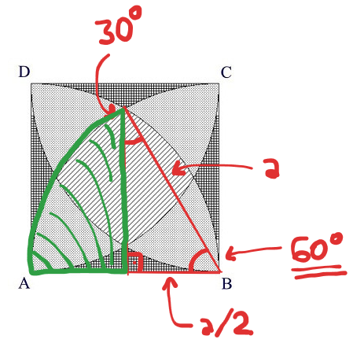

# 1291 - Será Isso Integração?

## [Descrição](https://www.beecrowd.com.br/judge/pt/problems/view/1291)

## Solução

Aqui queremos saber a área de três partes diferentes:

1. A parte listrada (do meio), cuja área representaremos como $A_{1}$.
2. A parte pontilhada (os "triângulos arredondados"), cuja área representaremos como $A_{2}$.
3. A parte quadriculada (os cantinhos), cuja área representaremos como $A_{3}$.

O que conseguimos calcular logo de cara são três áreas:

1. A área do quadrado como um todo, que é $A_{quadrado} = a^{2}$.
2. A área de um quarto de círculo com o raio do tamanho do lado quadrado, uma área que aqui acaba abarcando toda a área do tipo 1, quase toda do tipo 2 e metade do tipo 3. Essa área é $A_{quarto} = \frac{\pi a^{2}}{4}$.
3. A área complementar a essas, que abarca a outra metade da área do tipo 3 e um quarto da área do tipo 2. Essa área é $A_{complementar} = a^{2} - \frac{\pi a^{2}}{4} = \frac{(4 - \pi) a^{2}}{4}$.

Falando em termos mais matemáticos, temos que as seguintes igualdades são verdadeiras:

* $A_{quadrado} = A_{1} + A_{2} + A_{3}$
* $A_{quarto} = A_{1} + \frac{3A_{2}}{4} + \frac{A_{3}}{2}$
* $A_{complementar} = \frac{A_{2}}{4} + \frac{A_{3}}{2}$

Mas também temos como descobrir uma quarta área, a área realçada em verde na figura abaixo:

No quadrado, temos um triângulo retângulo com base $\frac{a}{2}$ e hipotenusa $a$, onde pela lei dos senos podemos ver que o ângulo apontando pra base mede $30º$ e por conseguinte, o ângulo apontando para o setor em verde tem $60º$. Com isso, podemos calcular a área em verde como a área do setor menos a área do triângulo.

Logo, para a área do setor temos $A_{setor} = \frac{2A_{quarto}}{3}$ (já que $60º = \frac{2}{3}90º$).

Para a área do triângulo temos que calcula a altura do triângulo primeiro, fazendo

$$
\begin{split}
a^{2} = & altura^{2} + \Bigl (\frac{a}{2} \Bigr )^{2} \\
altura^{2} = & a^{2} - \frac{a^{2}}{4} \\
altura^{2} = & \frac{3a^{2}}{4} \\
altura = & \frac{a \sqrt{3}}{2}
\end{split}
$$

e daí a área fica

$$
\begin{split}
A = & \frac{\frac{a}{2} \frac{a \sqrt{3}}{2}}{2} \\
A = & \frac{a^{2} \sqrt{3}}{8}
\end{split}
$$

e então a área do segmento do setor em verde é

$$
\begin{split}
A_{segmento} = & A_{setor} - A \\
A_{segmento} = & \frac{2(\frac{\pi a^{2}}{4})}{3} - \frac{a^{2}\sqrt{3}}{8} \\
A_{segmento} = & \frac{\pi a^{2}}{6} - \frac{a^{2} \sqrt{3}}{8} \\
A_{segmento} = & \frac{a^{2}(4\pi - 3\sqrt{3})}{24}
\end{split}
$$

Logo, temos nossa quarta fórmula:

* $A_{segmento} = \frac{A_{1}}{2} + \frac{A_{2}}{4} + \frac{A_{3}}{8}$

Isolando variáveis e trocando-as de lugar nessas fórmulas, temos então as seguintes fórmulas para calcular o valor de cada variável:

* $A_{3} = 8A_{segmento} + 8A_{complementar} - 4A_{quadrado}$
* $A_{2} = 4A_{complementar} - 2A_{3}$
* $A_{1} = A_{quadrado} - A_{2} - A_{3}$