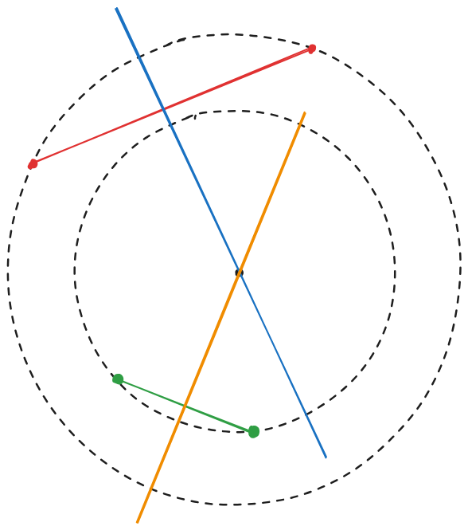

# 1783 - Ih, Ferrou, um Buraco Negro!

## [Descrição](https://www.beecrowd.com.br/judge/pt/problems/view/1783)

## Solução

A esquematização abaixo apresenta um jeito de obter as coordenadas do centro do círculo.

Os pontos de cores iguais são ligados por um segmento de reta de mesma cor e no meio desse segmento sai uma reta perpendicular a cada (em azul e laranja). O ponto onde essas retas perpendiculares se encontram é o centro do círculo.

> Algumas observações a se fazer é que podemos ter problemas de precisão que resultam em resultados saindo como `-0.00`. Nesse caso, precisamos fazer um teste se o número está em um determinado intervalo de precisão para ajustar o resultado para `0.00`. Além disso, precisamos lidar com dois casos estranhos: se a reta entre dois pontos é vertical, isso precisa ser representado como $m = \infty$ e a reta perpendicular a uma reta horizontal também precisa ter $m = \infty$. No código mesmo isso é representado como um valor grande o suficiente para os casos de teste.