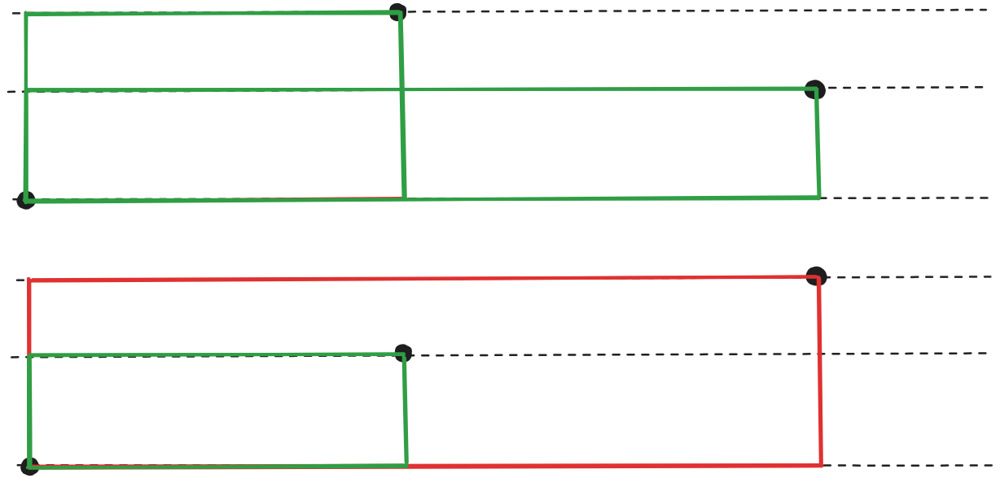

# 1938 - Praça do Retângulo

## [Descrição](https://www.beecrowd.com.br/judge/pt/problems/view/1938)

## Solução

Uma praça é definida por um poste em um dos cantos do retângulo e outro poste no canto oposto. Como temos poucos postes, podemos testar todos os pares possíveis e verificar se:

* A área entre eles é não-nula, isso é, eles não tem a mesma coordenada $x$ ou $y$.
* Não há outro poste na área entre esses postes.

Um jeito de fazer isso é primeiramente ordenando todos os postes pela coordenada $x$ pois a partir daí só precisamos lidar com a coordenada $y$. A partir daí, para cada poste, consideramos apenas os postes estritamente acima e estritamente abaixo do poste que estamos verificando, inicializando os limites superior e inferior para um número muito grande e outro muito pequeno respectivamente:

* Se um poste está acima do nosso, temos que ver se ele está abaixo de um determinado limite superior.
    * Se ele estiver abaixo ou no limite superior, isso significa que o retângulo pode ser formado. Nesse caso, atribua ao limite superior agora a coordenada $y$ desse poste.
    * Caso contrário, isso significa que há outro poste com aquela altura e que portanto seria incluído no retângulo.
* Se um poste está abaixo do nosso, passa-se por um processo similar, só que em relação ao limite inferior.

