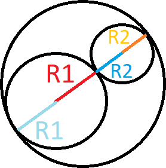

# 1589 - Bob Conduite

## [Descrição](https://www.beecrowd.com.br/judge/pt/problems/view/1589)

## Solução

Imagine dois círculos colados um no outro de forma, ou seja, o mais próximos um do outro possível sem sobreposição. Nesta situação, se traçarmos uma reta entre os dois centros dos círculos, temos que o tamanho dessa reta é de, no mínimo, `R1 + R2`. Com isso, já que temos uma reta entre os dois centros, podemos completar essa reta com as outras pontas do círculo, o que daria numa reta que seria o diâmetro do círculo maior. As retas faltantes teriam tamanho igual aos raios dos círculos também, o que então faria com que o diâmetro do círculo maior fosse `2 * R1 + 2 * R2`. Logo, se o diâmetro é esse, então o raio mínimo do círculo maior é `R1 + R2`.

Configura a figura abaixo para melhor ilustração do conceito explicado acima:



### C99

```c
#include <stdio.h>

int main()
{
    int T, R1, R2;

    scanf("%d", &T);
    for (int i = 0; i < T; ++i)
    {
        scanf("%d %d", &R1, &R2);
        printf("%d\n", R1 + R2);
    }

    return 0;
}
```

### C++17

```cpp
#include <iostream>

using namespace std;

int main()
{
    int T, R1, R2;

    cin >> T;
    for (int i = 0; i < T; ++i)
    {
        cin >> R1 >> R2;
        cout << R1 + R2 << endl;
    }

    return 0;
}
```

### C#

```cs
using System;
using System.Collections.Generic;
using System.Linq;

class URI {
    static void Main(string[] args) {
        int T = int.Parse(Console.ReadLine());
        for(int i = 0; i < T; ++i){
            List<int> entrada = Console.ReadLine().Trim().Split(' ').Select((x) => int.Parse(x)).ToList();
            Console.WriteLine(entrada[0] + entrada[1]);
        }
    }
}
```

### Java 14

```java
import java.io.BufferedReader;
import java.io.IOException;
import java.io.InputStreamReader;

public class Main {
    public static void main(String[] args) throws IOException {
        InputStreamReader ir = new InputStreamReader(System.in);
        BufferedReader in = new BufferedReader(ir);
    
        int T = Integer.parseInt(in.readLine());
        for(int i = 0; i < T; ++i){
            String[] entrada = in.readLine().trim().split(" ");
            System.out.println(Integer.parseInt(entrada[0]) + Integer.parseInt(entrada[1]));
        }
    }
}
```

### Javascript 12.18

```js
var input = require('fs').readFileSync('/dev/stdin', 'utf8');
var lines = input.split('\n');

let T = parseInt(lines.shift());
for (let i = 0; i < T; ++i) {
    let [R1, R2] = lines.shift().trim().split(' ').map((x) => parseInt(x));
    console.log(R1 + R2);
}
```

### Python 3.9

```py
T = int(input())
for _ in range(T):
    R1, R2 = [int(x) for x in input().strip().split(' ')]
    print(R1 + R2)
```