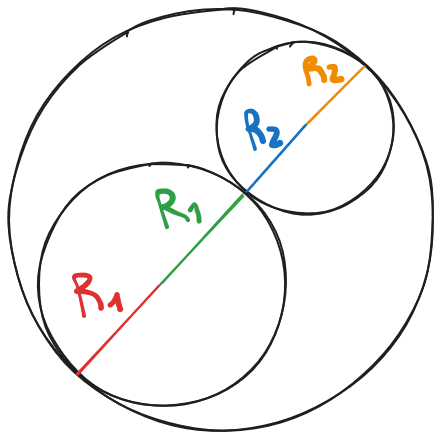

# 1589 - Bob Conduite

## [Descrição](https://www.beecrowd.com.br/judge/pt/problems/view/1589)

## Solução

Imagine dois círculos colados um no outro de forma, ou seja, o mais próximos um do outro possível sem sobreposição (com apenas um ponto em comum entre eles). Nesta situação, se traçarmos uma reta entre os dois centros dos círculos, temos que o tamanho dessa reta é $R_{1} + R_{2}$. Com isso, já que temos uma reta entre os dois centros, podemos completar essa reta com as outras pontas do círculo, o que daria numa reta que seria o diâmetro do círculo maior. As retas faltantes teriam tamanho igual aos raios dos círculos também, o que então faria com que o diâmetro do círculo maior fosse $2R_{1} + 2R_{2}$. Logo, se o diâmetro é esse, então o raio mínimo do círculo maior é $R_{1} + R_{2}$.

Configura a figura abaixo para melhor ilustração do conceito explicado acima:

