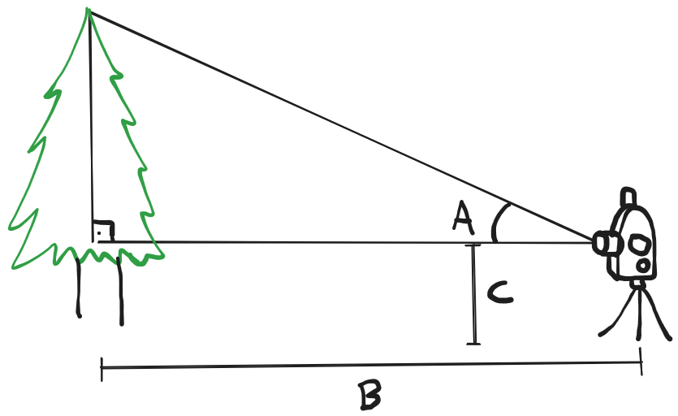

# 1761 - Decoração Natalina

## [Descrição](https://www.beecrowd.com.br/judge/pt/problems/view/1761)

## Solução

Um [teodolito](https://pt.wikipedia.org/wiki/Teodolito) é um equipamento que fica nivelado ao chão e que pode ser usado para medir a altura de um objeto, construção ou formação natural. Na figura abaixo, o ângulo A representa o ângulo de elevação do teodolito em relação ao chão a fim de ver o topo da árvore, a reta B representa a distância entre o teodolito e a árvore e a reta C representa a altura do teodolito, que é a mesma do duende que está medindo a árvore.

Com essas três informações, é possível descobrir a altura total da árvore com a seguinte fórmula:

$$
altura = \tan{\frac{A\pi}{180} \cdot B + C}
$$

onde a fórmula já converte o ângulo $A$ de graus para radianos. Lembrando que o comprimento dos cordões luminosos deve ser $5$ vezes maior que a altura da árvore.