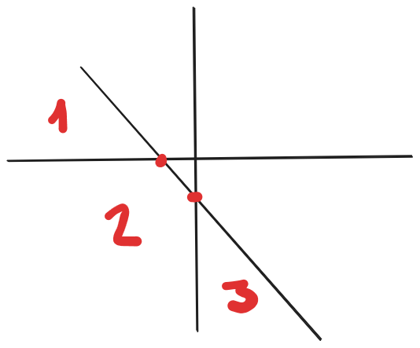

# 2218 - O Temível Evil-Son

## [Descrição](https://www.beecrowd.com.br/judge/pt/problems/view/2218)

## Solução

Para pensar em como resolver esse problema, podemos fazer uma prova por indução começando com $1$ reta dividindo o território em $1 + 1$ regiões e após isso provar que, se com $k$ retas dividimos o território em $1 + 1 + 2 + \ldots + k$ regiões, então com $k + 1$ retas dividimos o território em $1 + 1 + 2 + \cdots + k + (k + 1)$ regiões (ou seja, são acrescentadas $k + 1$ regiões).

### Caso base: $k = 1$

Com $1$ reta, dividimos o território em $2$ regiões, uma de um lado e outra do outro lado da reta.

### Indução: se para $k$ retas temos $1 + 1 + \cdots + k$ regiões, então para $k + 1$ retas temos $1 + 1 + \cdots + k + (k + 1)$ regiões

Considerando que todas as retas a serem acrescentadas não podem ser paralelas a nenhuma outra reta existente e nem podem interceptar com outras três retas em um ponto, isso significa que cada nova reta vai se interseccionar uma única vez com cada uma das retas já presentes. Com isso, haverá $k$ novas interseções (as interseções da $k + 1$-ésima linha com as $k$ retas já existentes), que gerarão mais $k + 1$ regiões.

A figura abaixo exemplifica a divisão de regiões para $k + 1 = 3$:

